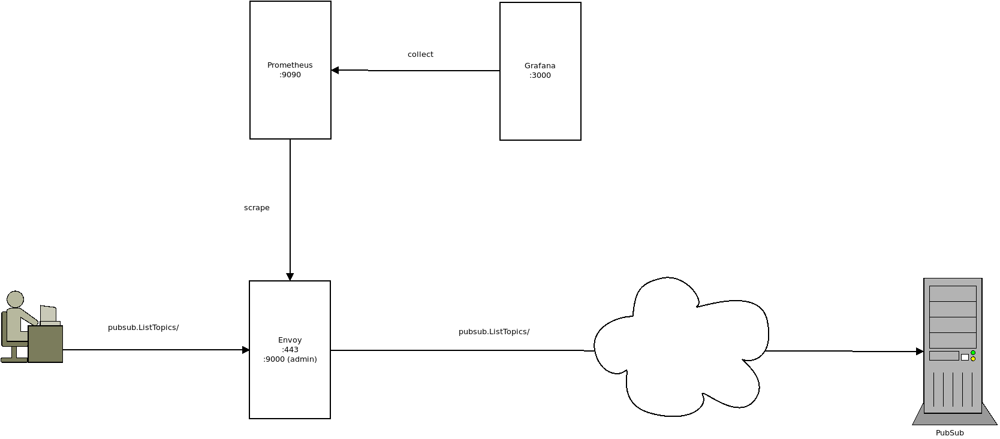
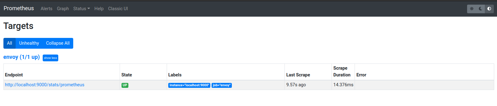
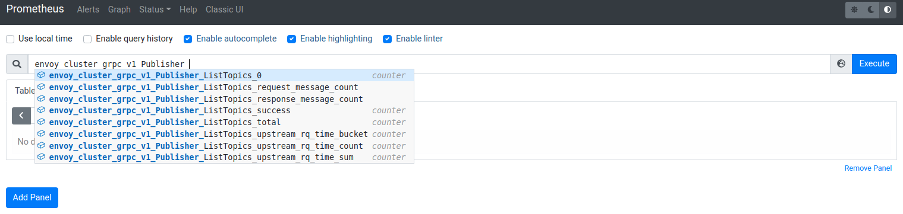
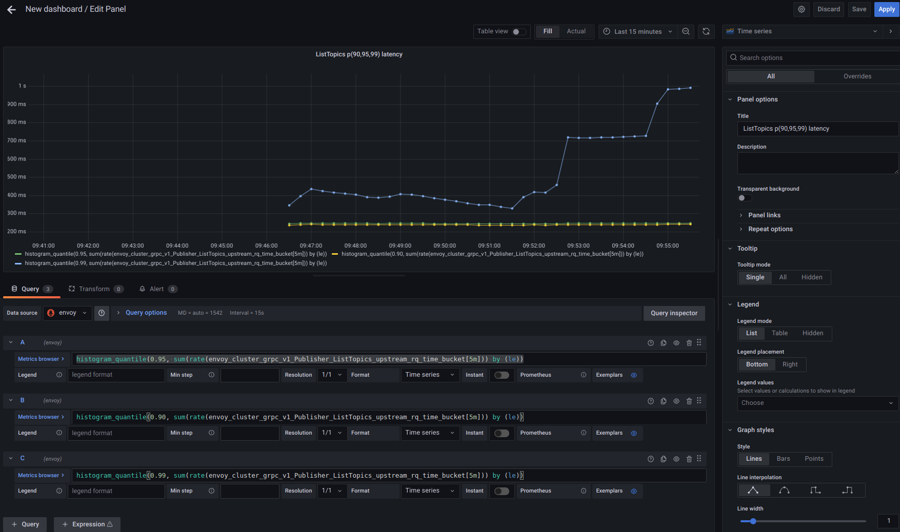

## Monitoring GCP API Latency locally using Envoy


Sample `envoy-prometheus-grafana` setup you can run locally to monitor GCP _gRPC_ API traffic statistics.

While Google Cloud offers a [suite of monitoring tools and services](https://cloud.google.com/monitoring/docs), the data that is shown is aggregated across all clients and really shows API latency statistics once the request is received.

That is, customers can directly observe how a GCP API responds by setting up monitoring over the [consumed_api](https://cloud.google.com/monitoring/api/resources#tag_consumed_api) metric as described in [Creating a Dashboard with Stackdriver SLI Monitoring Metrics](https://medium.com/google-cloud/creating-a-dashboard-with-stackdriver-sli-monitoring-metrics-eaf6d19386de)

The focus of this setup is different:  monitor GCP API calls as viewed by an individual client from your laptop.  Use this to test and observe latency as seen by an individual client.

There are several ways todo this ranging from

- the really low level using `tcpdump`:  [Using Wireshark to decrypt TLS gRPC Client-Server protobuf messages](https://blog.salrashid.dev/articles/2021/wireshark-grpc-tls/)

- to using Envoy to fork, decrypt and monitor the response ([Envoy TAP filter for gRPC](https://blog.salrashid.dev/articles/2021/envoy_tap/))

- to enabling an excruciating amount of logging and parsing timestamps from them (see [gRPC Environment Variables](https://github.com/grpc/grpc/blob/master/doc/environment_variables.md))

- to instrumenting code and emitting traces (see [Google Cloud Trace context propagation and metrics graphs with Grafana+Prometheus and Stackdriver](https://github.com/salrashid123/cloud_trace))


As mentioned, this repo takes the most 'hands off' approach to just seeing local statistics by using envoy to emit gRPC statistics which are consumable by `prometheus`.  This article is a variation of what is described here in [gRPC per method observability with envoy, Istio, OpenCensus and GKE](https://blog.salrashid.dev/articles/2021/grpc_stats_envoy_istio/)

---

### Setup

To get started, we will override the trust certificate store and `/etc/hosts` file so that clients "think" they're talking to google when infact they're communicating with envoy.




>> **NOTE** once you are done testing, please remember to remove the overrides shown below (both the trust CA and hosts file override!)

### Override TLS CA

First thing is to override the TLS CA that the GCP client library uses.  By default, it is the system root trust but we need to override that since envoy intercepts the traffic.

see [Override Trust certificates for TLS for Google Cloud Client Libraries](https://blog.salrashid.dev/articles/2021/cloud_sdk_missing_manual/override_trust_certificates_for_tls/)

Edit `/etc/ssl/certs/ca-certificates.crt`

Add the certificates shown in the appendix into that file

The first one is the root certificate and the second one is the TLS subCA that signed `certs/googleapis.crt`.  Note that `googleapis.crt` has all the SNI values you could use for other services too.


### Override /etc/hosts

Now override the hosts file on your local system to redirect traffic from your client intended for `pubsub.googleapis.com` to your localhost address where envoy is running

Edit `/etc/hosts`

```bash
127.0.0.1	pubsub.googleapis.com
```

Envoy docker container uses its own DNS resolver which means its not subject to this override and will contact pubsub proper.


### Run Envoy

We are using a [pretty recent version](https://hub.docker.com/layers/envoyproxy/envoy-dev/2e6db8378477a4a63740746c5bfeb264cd76bc34/images/sha256-383baeb2fab183d658e18048a121f567eb8cd0f1fa685ba06b2ab7e4f4df537c?context=explore) of envoy-in-a-container.

```bash
# build the local image using that as a base
docker build -t local_envoy .

# note docker is listening on a privleged port here
docker run -ti -p 443:8080  -p 127.0.0.1:9000:9000 local_envoy -c /etc/envoy/envoy.yaml -l info
```

Note that we enabled envoy's built in gRPC statistics emitter:

```yaml
          http_filters:
          - name: envoy.filters.http.grpc_stats
            typed_config:
              "@type": type.googleapis.com/envoy.extensions.filters.http.grpc_stats.v3.FilterConfig
              stats_for_all_methods: true
              enable_upstream_stats: true     
```

That would show the gRPC statistics for clients traversing envoy for all filters.

Before we can see the gRPC statistics we are interested in, we need to run a client.

### Run PubSub Client

First edit `client/main.go` and add in your projectID (you ofcourse need permissions to list topics in that project!)

Note that the script simply loops over every second indefinitely. 

```golang
package main

import (
	"fmt"
	"time"

	pubsub "cloud.google.com/go/pubsub"
	"golang.org/x/net/context"
	"google.golang.org/api/iterator"
)

const (
	projectID = "your_project_id_here"
)

func main() {
	for {
		ctx := context.Background()
		pubsubClient, err := pubsub.NewClient(ctx, projectID)
		if err != nil {
			fmt.Printf("pubsub.NewClient: %v", err)
			return
		}
		defer pubsubClient.Close()

		pit := pubsubClient.Topics(ctx)
		for {
			topic, err := pit.Next()
			if err == iterator.Done {
				break
			}
			if err != nil {
				fmt.Printf("pubssub.Iterating error: %v", err)
				return
			}
			fmt.Printf("Topic Name: %s\n", topic.ID())
		}
		time.Sleep(1000)
	}
}
```

Also note that critically we have NOT changed anything in the code..thats the idea: we want to monitor the app without altering the trust certificates.  (if you needed to do that, see the snippet in the appendix)

Once you send in some traffic, you can monitor the promethus endpoint within envoy by going to [http://localhost:9000/stats/prometheus](http://localhost:9000/stats/prometheus)


You should see some gRPC Stats like the following

```bash

# TYPE envoy_cluster_external_upstream_rq_xx counter
envoy_cluster_external_upstream_rq_xx{envoy_response_code_class="2",envoy_cluster_name="service_pubsub"} 315

# TYPE envoy_cluster_grpc_v1_Publisher_ListTopics_0 counter
envoy_cluster_grpc_v1_Publisher_ListTopics_0{envoy_grpc_bridge_method="pubsub",envoy_grpc_bridge_service="google",envoy_cluster_name="service_pubsub"} 315

# TYPE envoy_cluster_grpc_v1_Publisher_ListTopics_request_message_count counter
envoy_cluster_grpc_v1_Publisher_ListTopics_request_message_count{envoy_grpc_bridge_method="pubsub",envoy_grpc_bridge_service="google",envoy_cluster_name="service_pubsub"} 316

# TYPE envoy_cluster_grpc_v1_Publisher_ListTopics_response_message_count counter
envoy_cluster_grpc_v1_Publisher_ListTopics_response_message_count{envoy_grpc_bridge_method="pubsub",envoy_grpc_bridge_service="google",envoy_cluster_name="service_pubsub"} 315

# TYPE envoy_cluster_grpc_v1_Publisher_ListTopics_success counter
envoy_cluster_grpc_v1_Publisher_ListTopics_success{envoy_grpc_bridge_method="pubsub",envoy_grpc_bridge_service="google",envoy_cluster_name="service_pubsub"} 315

# TYPE envoy_cluster_grpc_v1_Publisher_ListTopics_total counter
envoy_cluster_grpc_v1_Publisher_ListTopics_total{envoy_grpc_bridge_method="pubsub",envoy_grpc_bridge_service="google",envoy_cluster_name="service_pubsub"} 315


# TYPE envoy_cluster_grpc_v1_Publisher_ListTopics_upstream_rq_time histogram
envoy_cluster_grpc_v1_Publisher_ListTopics_upstream_rq_time_bucket{envoy_grpc_bridge_method="pubsub",envoy_grpc_bridge_service="google",envoy_cluster_name="service_pubsub",le="0.5"} 0
envoy_cluster_grpc_v1_Publisher_ListTopics_upstream_rq_time_bucket{envoy_grpc_bridge_method="pubsub",envoy_grpc_bridge_service="google",envoy_cluster_name="service_pubsub",le="1"} 0
envoy_cluster_grpc_v1_Publisher_ListTopics_upstream_rq_time_bucket{envoy_grpc_bridge_method="pubsub",envoy_grpc_bridge_service="google",envoy_cluster_name="service_pubsub",le="5"} 0
envoy_cluster_grpc_v1_Publisher_ListTopics_upstream_rq_time_bucket{envoy_grpc_bridge_method="pubsub",envoy_grpc_bridge_service="google",envoy_cluster_name="service_pubsub",le="10"} 0
envoy_cluster_grpc_v1_Publisher_ListTopics_upstream_rq_time_bucket{envoy_grpc_bridge_method="pubsub",envoy_grpc_bridge_service="google",envoy_cluster_name="service_pubsub",le="25"} 0
envoy_cluster_grpc_v1_Publisher_ListTopics_upstream_rq_time_bucket{envoy_grpc_bridge_method="pubsub",envoy_grpc_bridge_service="google",envoy_cluster_name="service_pubsub",le="50"} 0
envoy_cluster_grpc_v1_Publisher_ListTopics_upstream_rq_time_bucket{envoy_grpc_bridge_method="pubsub",envoy_grpc_bridge_service="google",envoy_cluster_name="service_pubsub",le="100"} 0
envoy_cluster_grpc_v1_Publisher_ListTopics_upstream_rq_time_bucket{envoy_grpc_bridge_method="pubsub",envoy_grpc_bridge_service="google",envoy_cluster_name="service_pubsub",le="250"} 293
envoy_cluster_grpc_v1_Publisher_ListTopics_upstream_rq_time_bucket{envoy_grpc_bridge_method="pubsub",envoy_grpc_bridge_service="google",envoy_cluster_name="service_pubsub",le="500"} 302
envoy_cluster_grpc_v1_Publisher_ListTopics_upstream_rq_time_bucket{envoy_grpc_bridge_method="pubsub",envoy_grpc_bridge_service="google",envoy_cluster_name="service_pubsub",le="1000"} 302
envoy_cluster_grpc_v1_Publisher_ListTopics_upstream_rq_time_bucket{envoy_grpc_bridge_method="pubsub",envoy_grpc_bridge_service="google",envoy_cluster_name="service_pubsub",le="2500"} 302
envoy_cluster_grpc_v1_Publisher_ListTopics_upstream_rq_time_bucket{envoy_grpc_bridge_method="pubsub",envoy_grpc_bridge_service="google",envoy_cluster_name="service_pubsub",le="5000"} 302
envoy_cluster_grpc_v1_Publisher_ListTopics_upstream_rq_time_bucket{envoy_grpc_bridge_method="pubsub",envoy_grpc_bridge_service="google",envoy_cluster_name="service_pubsub",le="10000"} 302
envoy_cluster_grpc_v1_Publisher_ListTopics_upstream_rq_time_bucket{envoy_grpc_bridge_method="pubsub",envoy_grpc_bridge_service="google",envoy_cluster_name="service_pubsub",le="30000"} 302
envoy_cluster_grpc_v1_Publisher_ListTopics_upstream_rq_time_bucket{envoy_grpc_bridge_method="pubsub",envoy_grpc_bridge_service="google",envoy_cluster_name="service_pubsub",le="60000"} 302
envoy_cluster_grpc_v1_Publisher_ListTopics_upstream_rq_time_bucket{envoy_grpc_bridge_method="pubsub",envoy_grpc_bridge_service="google",envoy_cluster_name="service_pubsub",le="300000"} 302
envoy_cluster_grpc_v1_Publisher_ListTopics_upstream_rq_time_bucket{envoy_grpc_bridge_method="pubsub",envoy_grpc_bridge_service="google",envoy_cluster_name="service_pubsub",le="600000"} 302
envoy_cluster_grpc_v1_Publisher_ListTopics_upstream_rq_time_bucket{envoy_grpc_bridge_method="pubsub",envoy_grpc_bridge_service="google",envoy_cluster_name="service_pubsub",le="1800000"} 302
envoy_cluster_grpc_v1_Publisher_ListTopics_upstream_rq_time_bucket{envoy_grpc_bridge_method="pubsub",envoy_grpc_bridge_service="google",envoy_cluster_name="service_pubsub",le="3600000"} 302
envoy_cluster_grpc_v1_Publisher_ListTopics_upstream_rq_time_bucket{envoy_grpc_bridge_method="pubsub",envoy_grpc_bridge_service="google",envoy_cluster_name="service_pubsub",le="+Inf"} 302
envoy_cluster_grpc_v1_Publisher_ListTopics_upstream_rq_time_sum{envoy_grpc_bridge_method="pubsub",envoy_grpc_bridge_service="google",envoy_cluster_name="service_pubsub"} 55370
envoy_cluster_grpc_v1_Publisher_ListTopics_upstream_rq_time_count{envoy_grpc_bridge_method="pubsub",envoy_grpc_bridge_service="google",envoy_cluster_name="service_pubsub"} 302
```

### Run Prometheus

Now run prometheus in a container.

The following `promethus.yml` file will automatically connect to the envoy stats endpoint shown above and will begin to scrape data

```bash
docker run \
    --net=host \
    -p 9090:9090 \
    -v `pwd`/prometheus/prometheus.yml:/etc/prometheus/prometheus.yml \
    prom/prometheus
```

Verify Envoy Target is running by going to [http://localhost:9090/targets](http://localhost:9090/targets)



You should also see prometheus collecting gRPC Statistics



### Run Grafana

Now that prometheus is collecting data, we can now ask `grafana` to use it as a datasource.

First run Grafana ina container

```bash
docker run --net=host -p 3000:3000 grafana/grafana 
```

Access Console at [http://localhost:3000](http://localhost:3000) (the default username/password is `admin/admin`)

Configure the prometheus `Datasource`

so under `configuration => datasources`,  Select `Prometheus`, set

```
    Name: `envoy`
    URL: `http://localhost:9090/`
```

Click Test (which hopefully works!).

From there, you can display the usages statistics as graph:




---

#### Appendix

#### gRPC Environment Variables


To enable verbose logging for gRPC see the setof [gRPC Environment Variables](https://github.com/grpc/grpc/blob/master/doc/environment_variables.md)

Specifically for golang, enable the set shown below

```bash
export GRPC_VERBOSITY=DEBUG 
export GRPC_TRACE=all
# export GRPC_GO_LOG_VERBOSITY_LEVEL=99 
# export GRPC_GO_LOG_SEVERITY_LEVEL=info
```


#### TLS CA

Thseare the TLS Certificates used for this sample that you should add to `/etc/ssl/certs/ca-certificates.crt` (on debian, atleast)


```text
-----BEGIN CERTIFICATE-----
MIIEDTCCAvWgAwIBAgIBAjANBgkqhkiG9w0BAQsFADBQMQswCQYDVQQGEwJVUzEP
MA0GA1UECgwGR29vZ2xlMRMwEQYDVQQLDApFbnRlcnByaXNlMRswGQYDVQQDDBJF
bnRlcnByaXNlIFJvb3QgQ0EwHhcNMjIwMTA5MjIwNTQzWhcNMzIwMTA5MjIwNTQz
WjBXMQswCQYDVQQGEwJVUzEPMA0GA1UECgwGR29vZ2xlMRMwEQYDVQQLDApFbnRl
cnByaXNlMSIwIAYDVQQDDBlFbnRlcnByaXNlIFN1Ym9yZGluYXRlIENBMIIBIjAN
BgkqhkiG9w0BAQEFAAOCAQ8AMIIBCgKCAQEAzQESuYrJ5UvVzNl6K9HL2wIjKpi1
ZmUNNlDonwIG/8Oqppv8Ll55uK5LsQnPEPjiu6dxeO7LH/YMZDIZMYSn626QKS6c
BQ67WWHp2xvb4zXIpjnwLt6FX++ps8yZNwPnT6ykzUUdTgvDPHziscqv8iBiNJv0
zsmT9syZNfXyFMMQVPvIlE7hB45xjGGnJ5zHSWrIXz0ik4Jh7IBRhM4LM7ki7uVP
q6195cB63L9HHwRzfpaGbusptEymRbnjTYEru/xIHH71JRlBJKI6s5fx1iaAzOHw
4+bQOsvfc3lr5nsyDOPukvne3rLSUPkgSYLtlEvPewp35wHiXlDsEgMs7wIDAQAB
o4HqMIHnMA4GA1UdDwEB/wQEAwIBBjASBgNVHRMBAf8ECDAGAQH/AgEAMB0GA1Ud
DgQWBBS3urACoee+NMbBBVxmeOW7U12hVDAfBgNVHSMEGDAWgBR8HFvoPrMzCZaS
Mth/RL/MjJOckjBFBggrBgEFBQcBAQQ5MDcwNQYIKwYBBQUHMAKGKWh0dHA6Ly9w
a2kuZXNvZGVtb2FwcDIuY29tL2NhL3Jvb3QtY2EuY2VyMDoGA1UdHwQzMDEwL6At
oCuGKWh0dHA6Ly9wa2kuZXNvZGVtb2FwcDIuY29tL2NhL3Jvb3QtY2EuY3JsMA0G
CSqGSIb3DQEBCwUAA4IBAQDCrrAwdeRQMovu00ws8I3reUIMEdtsFwLRShu0ggVh
GHMH1vGDpdRJoaSpCGdCcPv1IA0BkL6969df1GDUxQOWbiLajyQ5S6fVFgZ/yIbn
3SzMw7Dubig2i9xJo9laPpjjjM/gF6bBSxdhoLUKLFf0e82FCuAPXskeiW7Bc1XB
3ui4xgPNVz3THu8Ma9z/fTJRohrC8t1C/pab7TQpcQR6XkRrX5Sb/MM6TnFew7sD
5cuFT7o/DvbWT42/UP2nuNi591TIGYDJBCKBqnd0AH6Rz+VTyeRUVp4j21ExtzL0
JKmN1S+dmP5W6P1EV+ztEllKEV3N/e6r655wlDG/0y7G
-----END CERTIFICATE-----
-----BEGIN CERTIFICATE-----
MIIDfjCCAmagAwIBAgIBATANBgkqhkiG9w0BAQsFADBQMQswCQYDVQQGEwJVUzEP
MA0GA1UECgwGR29vZ2xlMRMwEQYDVQQLDApFbnRlcnByaXNlMRswGQYDVQQDDBJF
bnRlcnByaXNlIFJvb3QgQ0EwHhcNMjIwMTA5MjIwNTA3WhcNMzIwMTA5MjIwNTA3
WjBQMQswCQYDVQQGEwJVUzEPMA0GA1UECgwGR29vZ2xlMRMwEQYDVQQLDApFbnRl
cnByaXNlMRswGQYDVQQDDBJFbnRlcnByaXNlIFJvb3QgQ0EwggEiMA0GCSqGSIb3
DQEBAQUAA4IBDwAwggEKAoIBAQDe7oaYpGyScYWqdhYThbvXSTflEQNJc6YxxtD7
J8pw7MLQ24jXOpcgSf17SnZy0MkWMQcUhjuZZ2+IcPynpGCBrzVoiBR1089miihV
rGOYVpEsVVkO7f43Km95EQjKQcR40daDwTV8oPRy218WT/cEMCZLWJnNUn0KkeEp
PRE9LxEfaw/nlWPv4E3H1rkVOjxrUTbr31XiouDiJKk+MD92FagaE+HjsrWu5lli
pCtkdN+C5aOsyW/GOSjsk1e+F8VxFIXYrhz3KZQQba3+++ozXm7l84xzHFBeD1dV
x0NzzCpWkTUrwchupo7JS3t1aIcXOnrtbVT2djytA+DjtXj9AgMBAAGjYzBhMA4G
A1UdDwEB/wQEAwIBBjAPBgNVHRMBAf8EBTADAQH/MB0GA1UdDgQWBBR8HFvoPrMz
CZaSMth/RL/MjJOckjAfBgNVHSMEGDAWgBR8HFvoPrMzCZaSMth/RL/MjJOckjAN
BgkqhkiG9w0BAQsFAAOCAQEAxFDSsuw7yRsWQvChxZcmzhHk006zMjb1mxVPPYC4
ByCJJkPlt5u3N76lfFqSLjaxc6I1ty7Ro1WMfZkZQwiNOoh4fgHjzhldfK+yTQuT
CPPUs3X107UYmrDLVS+zJ2w4saF1tW3CU8WRngnHs4H+LKgJCuzd7dYQeGTOyb0l
rt7YhmjQD+7bc7bAvHrkpfows2x6P+OHIFzQjnj67OyFgQOmWMTITe7MAyJo7aS7
d6lWx5wzajDHUHXrZztAUgHUZ7UZzULQ6vXD/eehOm0rImsvYYWbjlCONLlOAF3S
iZZHs9es65r6dgc0YVGgLyBpXvbdBiseyIJ/zvC6XBL/8g==
-----END CERTIFICATE-----
```

You are free to generate your own using [CA Scratchpad](https://github.com/salrashid123/ca_scratchpad)

If you do use your own CA, please remember that when you configure the certificate envoy will use (`certs/googleapis.crt`) to include all the SNI hosts you intend to test:

eg

```
            X509v3 Subject Alternative Name: 
                DNS:edgecert.googleapis.com, DNS:android.googleapis.com, DNS:bigtable.googleapis.com, DNS:clouderrorreporting.googleapis.com, DNS:cloudtrace.googleapis.com, DNS:container.googleapis.com, DNS:dataflow.googleapis.com, DNS:datastore.googleapis.com, DNS:dlp.googleapis.com, DNS:fcm.googleapis.com, DNS:firestore.googleapis.com, DNS:logging.googleapis.com, DNS:monitoring.googleapis.com, DNS:pubsub.googleapis.com, DNS:runtimeconfig.googleapis.com, DNS:servicecontrol.googleapis.com, DNS:spanner.googleapis.com, DNS:stackdriver.googleapis.com, DNS:*.googleapis.com
```


#### Set Trust CA for GCP CLients

If you want to set the trust and host overrides in code:

```golang
	rootCAs := x509.NewCertPool()
	pem, err := ioutil.ReadFile("../certs/tls-ca.crt")
	if err != nil {
		fmt.Printf("failed to load root CA certificates  error=%v", err)
		return
	}
	if !rootCAs.AppendCertsFromPEM(pem) {
		fmt.Printf("no root CA certs parsed from file ")
		return
	}

	transportCreds := credentials.NewTLS(&tls.Config{
		RootCAs: rootCAs,
	})

	pubsubClient, err := pubsub.NewClient(ctx, projectID,
		option.WithEndpoint("pubsub.googleapis.com:443"),
		option.WithGRPCDialOption(grpc.WithTransportCredentials(transportCreds)))
```


#### Running Envoy on deprivleged ports

As mentioned, envoy's container listens on privleged port `:443`.  

If you would rather run it on a different port, you still need some listener or redirect on `:443` and perform a redirect.  
There are several ways to do that using `socat` or `iptables` as described [here](https://github.com/salrashid123/gce_metadata_server#usage). 
Just note that to do part itself requires admin privileges.